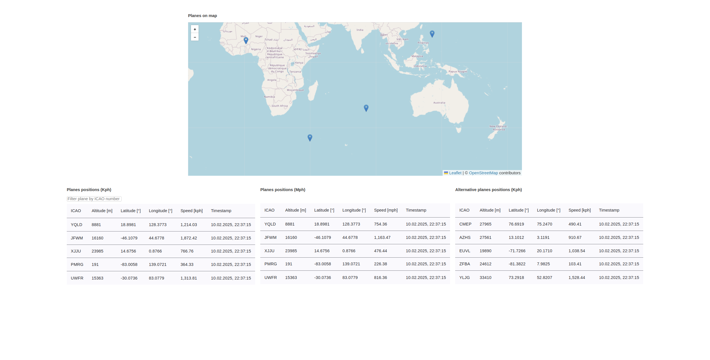

# PlaneFramesApp

This a plane frames visualizer application with custom generator.

To use this application in a dev to the following steps:

## Install modules

To install dependencies, run:

```
npm install
```

## Development server

To start a local development server, run:

```
npm start
```

## The Dashboard

Once the server is running, open your browser and navigate to `http://localhost:4200/`
to access the dashboard with planes positions visible on the Leaflet map and their last positions summarized in 3 tables:



The ICAO number represents the plane. Blue markers are representing the last position of the plane.
Positions are recalculated every 1 sec and visualised on the map.

## Running unit tests

You can run tests with the following command:

```
npm test
```

That will open the browser [Karma](https://karma-runner.github.io) tests view.

## Additional Resources

For more information on using the Angular CLI, including detailed command references, visit the [Angular CLI Overview and Command Reference](https://angular.dev/tools/cli) page.
